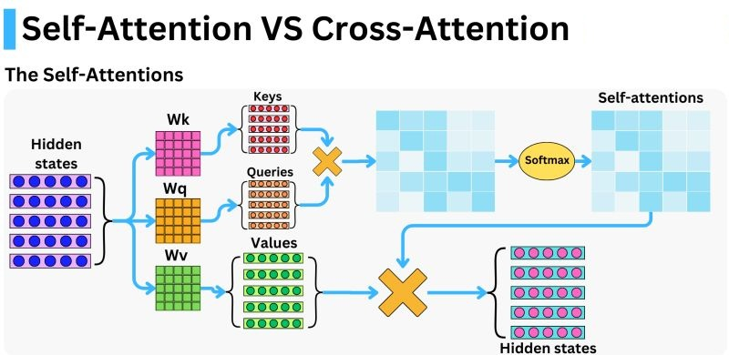
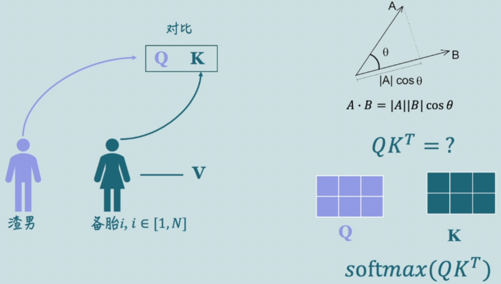

---

# 📑 目录

* [📌 注意力机制 Attention](#注意力机制-attention)
  * [🔹 基本原理：自注意力（Self-Attention）](#基本原理自注意力self-attention)
  * [🔹 多头注意力机制 Multi-Head Attention](#多头注意力机制multi-head-attention)
  * [🔹 掩码注意力 Masked Attention](#掩码注意力masked-attention)
  * [🔹 一句话理解 Attention](#一句话理解-attention)
  * [🔹 注意力优化技术](#注意力优化技术)
  * [🔹 MQA与GQA详解](#多头注意力机制-mqa与gqa)

  
---

以下是《📌 注意力机制 Attention》小节的技术总结，聚焦于 LLaMA 等大模型所采用的注意力机制及其演进

---

# 注意力机制 Attention

注意力机制（Attention Mechanism）是大型语言模型（LLM）的核心组件，它决定了模型在处理输入序列时如何动态地聚焦于最相关的信息。自从 Transformer 架构引入自注意力机制以来，注意力成为语言建模中提升表达能力与并行计算效率的关键手段。
在深度学习中，**注意力机制**的核心思想是：**在处理一组输入信息时，模型可以自动地“关注”最相关的部分**。这种机制帮助模型动态地分配“注意力权重”，类似人类在处理信息时聚焦重点。


## 基本原理：自注意力（Self-Attention）

在自注意力机制中，模型为输入序列中的每个位置计算一个“注意力分数”，以衡量该位置与其他位置的关系。计算公式如下：

$$
\text{Attention}(Q, K, V) = \text{softmax}\left(\frac{QK^T}{\sqrt{d_k}}\right)V
$$

其中：

* $Q$：Query 向量，表示当前关注的位置；
* $K$：Key 向量，表示参考的上下文位置；
* $V$：Value 向量，表示每个位置的值信息；
* $d_k$：Key 向量的维度，用于缩放防止梯度爆炸。

这种机制允许模型从输入序列的所有位置中“挑选”出最重要的信息，并对其进行加权组合。


[](https://raw.githubusercontent.com/zongwave/pixelcraft/main/ai/llm/hpu/attention/diagram/self-attention_sdpa.jpg)

---

## 多头注意力机制（Multi-Head Attention）

为了提升表达能力，Transformer 使用了 **多头注意力机制（Multi-Head Attention）**，即在不同的子空间中并行计算多个注意力输出，并将它们拼接融合：

$$
\text{MultiHead}(Q, K, V) = \text{Concat}(\text{head}_1, \dots, \text{head}_h)W^O
$$

每个 head 计算方式为：

$$
\text{head}_i = \text{Attention}(QW^Q_i, KW^K_i, VW^V_i)
$$

这种方式使模型能够同时关注不同位置、不同语义维度的信息。
模型将 Q、K、V 切分成多个子空间，**并行计算多个注意力头**，让每个头关注不同的信息粒度：

---

在多头注意力（Multi-Head Attention, MHA）机制中，我们通常处理的是三类张量：**输入嵌入（input embedding）**、**QKV投影矩阵**、**注意力得分（attention score）**。我们以下图为例说明。

---

### 🧩 输入维度定义

* `batch_size = B`（样本数量）
* `seq_len = L`（序列长度）
* `hidden_dim = D`（通常等于 `num_heads × head_dim`）
* `num_heads = H`
* `head_dim = d = D / H`（每个注意力头的维度）

输入张量的维度为：

```python
input: (B, L, D)
```

---

### 🔁 Q/K/V 投影矩阵的维度

每个输入通过线性投影变成 Q、K、V 向量：

```python
Q = input @ W_Q    # shape: (B, L, D)
K = input @ W_K    # shape: (B, L, D)
V = input @ W_V    # shape: (B, L, D)
```

其中 `W_Q, W_K, W_V ∈ ℝ^{D × D}`，也可以看成是：

```python
W_Q = nn.Linear(D, D)
```

再 reshape 成多头形式（按 `H` 个头分开）：

```python
Q → (B, H, L, d)
K → (B, H, L, d)
V → (B, H, L, d)
```

---

### 🧮 Attention Score 的计算

注意力得分是通过 Q 与 K 的点积得到的：

```python
score = Q @ K.transpose(-1, -2) / sqrt(d)
```

其维度为：

```python
score: (B, H, L, L)
```

解释：

* 每个头的 Q 是 `(L, d)`，K 是 `(L, d)`，所以 `Q × Kᵗ → (L, L)`
* 有 `H` 个头，所以最终是 `(B, H, L, L)`，表示每个位置对所有其他位置的关注程度

---

### 🧠 总结

| 张量              | 维度             | 含义                       |
| --------------- | -------------- | ------------------------ |
| Input           | `(B, L, D)`    | 原始输入嵌入                   |
| Q/K/V           | `(B, L, D)`    | 投影后的查询、键、值               |
| Q/K/V (头分离后)    | `(B, H, L, d)` | 拆分为多个头，每头维度为 `d = D / H` |
| Attention Score | `(B, H, L, L)` | 每个位置对其他位置的注意力权重          |
| Output per head | `(B, H, L, d)` | 每个注意力头的加权输出              |
| Final Output    | `(B, L, D)`    | 所有头连接后的结果，送入下一层          |


---


## 掩码注意力（Masked Attention）

在 LLM 里，**我们不希望模型偷看未来的信息**。所以在训练中对未来位置进行掩码处理，仅允许模型关注当前及以前的位置（即“左下三角”注意力矩阵）。

在 Transformer 中使用的掩码（mask）机制有助于限制模型的注意力范围，防止非法信息泄漏（如未来信息）或处理缺失/填充内容。常见的 Mask 类型主要包括以下几种：

---

### ✅ Transformer 中常见的 Mask 类型

| 掩码名称             | 英文名                           | 用途                   | 说明                                           |
| ---------------- | ----------------------------- | -------------------- | -------------------------------------------- |
| **填充掩码**         | Padding Mask                  | 屏蔽掉输入中无效的 padding 部分 | 防止模型关注填充（<pad>）token，常用于编码器和解码器              |
| **序列掩码 / 自回归掩码** | Causal Mask / Look-ahead Mask | 防止模型看到“未来”的 token    | 生成任务中使用，仅允许当前 token 看到之前位置的输出（左下三角）          |
| **解码器编码器掩码**     | Encoder-Decoder Mask          | 控制解码器对编码器输出的注意力      | 一般结合 padding mask，防止关注编码器输出中的 pad 部分         |
| **显式注意力掩码**      | Custom Attention Mask         | 根据任务自定义的注意力限制        | 例如只让某些 token 关注特定位置，或构建稀疏注意力模式（如 Longformer） |

---

### 🔍 各种 Mask 的具体形式与示意图

**1. Padding Mask（填充掩码）**

**输入示例**：

```text
[CLS] I love NLP [PAD] [PAD]
```

**掩码矩阵**：

```text
[1, 1, 1, 0, 0]  ← 1 表示保留，0 表示屏蔽
```

常用于：编码器和解码器的 self-attention、cross-attention。

---

**2. Causal / Look-ahead Mask（自回归掩码）**

限制模型只能看见当前位置及之前的 token。下图是一个 4×4 的 Causal Mask：

```
[[1, 0, 0, 0],
 [1, 1, 0, 0],
 [1, 1, 1, 0],
 [1, 1, 1, 1]]
```

也可表示为布尔型：

```python
mask = torch.tril(torch.ones(seq_len, seq_len)).bool()
```

常用于：解码器中的 self-attention。

---

**3. Encoder-Decoder Mask（解码器跨注意力掩码）**

用于限制 decoder 在 cross-attention 阶段仅关注 encoder 有效输出。

通常配合 padding mask，例如：

```text
encoder输出: "I love NLP [PAD]"
→ mask:       [1, 1, 1, 0]
```

---

**4. Custom Attention Mask（任务特定掩码）**

如稀疏注意力、局部窗口注意力、可学习 mask：

* [Longformer](https://arxiv.org/abs/2004.05150): 局部 + 全局 mask
* [BigBird](https://arxiv.org/abs/2007.14062): 随机 + 全局 + 局部注意力 mask
* [Perceiver](https://arxiv.org/abs/2103.03206): latent-to-input 的异构 mask

---

### 🧠 补充：掩码在实现中的表现形式

| 类型       | 实现中形式                                        | 应用位置               |
| -------- | -------------------------------------------- | ------------------ |
| 布尔型 Mask | `True/False` 矩阵                              | PyTorch、TensorFlow |
| 值 Mask   | 用 `-inf` 或 `-1e9` 等填充被 mask 位置，在 softmax 前屏蔽 | logits 上操作，数值稳定性高  |
| 权重 Mask  | 在 attention score 上乘权重                       | 特定稀疏注意力实现中         |

---


### ✅ 背景：Causal Mask 的作用

在 **自回归语言模型（如 GPT）** 中，causal mask 用于防止当前 token 看到未来的 token。

核心思想是在 `attention_scores` 上加一个 **下三角矩阵的 mask**，用 `-inf`（或非常大的负数）填充非法位置，然后再进行 softmax，从而将其注意力值变为 0。

---

### 🧪 示例：PyTorch + HuggingFace 中计算 attention scores + causal mask

```python
import torch
import torch.nn.functional as F

# 假设我们有一个 batch size = 1, 序列长度为 5，hidden_dim = 8
seq_len = 5
d_k = 8  # 注意力维度

# 模拟查询、键张量（Q, K），形状: [batch_size, num_heads, seq_len, d_k]
Q = torch.rand(1, 1, seq_len, d_k)
K = torch.rand(1, 1, seq_len, d_k)

# 1. 计算 Attention Score: QK^T / sqrt(d_k)
attention_scores = torch.matmul(Q, K.transpose(-2, -1)) / d_k**0.5
# 结果维度: [1, 1, seq_len, seq_len]

# 2. 构造 Causal Mask：下三角为1，上三角为0
causal_mask = torch.tril(torch.ones(seq_len, seq_len)).bool()  # shape: [seq_len, seq_len]
causal_mask = causal_mask.unsqueeze(0).unsqueeze(0)  # -> [1, 1, seq_len, seq_len]

# 3. 应用 mask: 将无效位置设为 -inf
attention_scores = attention_scores.masked_fill(~causal_mask, float('-inf'))

# 4. Softmax 归一化
attention_probs = F.softmax(attention_scores, dim=-1)

# 5. Attention_probs 即为 masked attention weights
print(attention_probs)
```

---

### 🎯 注意事项

* `masked_fill(~mask, -inf)` 中使用 `~` 是因为 mask 为 “允许位置”，我们要屏蔽的是“不允许的位置”。
* 在实际模型中，batch\_size 和 num\_heads 通常 >1，代码中会进行广播处理。
* HuggingFace 中，这部分通常由 `modeling_utils.py` → `apply_attention_mask()` 或 `attn_mask` 参数内部处理。

---

### 📌 与 HuggingFace 源码结合

在如 GPT2 模型中（`transformers/models/gpt2/modeling_gpt2.py`），你会看到类似如下逻辑：

```python
# attention_scores: [batch, heads, query_len, key_len]
attention_scores = torch.matmul(query, key.transpose(-1, -2)) / math.sqrt(self.head_dim)

# apply causal mask (lower triangular)
if causal_mask is not None:
    attention_scores = attention_scores.masked_fill(causal_mask == 0, -inf)

# softmax
attention_probs = nn.Softmax(dim=-1)(attention_scores)
```

---


## 一句话理解 Attention

> 给每个输入打分，再根据分数对它们加权求和，形成最终输出。

---

### 📐 数学公式与直观解释

经典的 **Scaled Dot-Product Attention** 公式如下：

$$
\text{Attention}(Q, K, V) = \text{softmax}\left(\frac{QK^T}{\sqrt{d_k}}\right)V
$$

* **Q（Query）**：当前要处理的位置，代表“我想找什么样的信息”
* **K（Key）**：输入中的其他位置，代表“我能提供什么”
* **V（Value）**：输入的实际内容，“我要传递的值”

### 通俗类比：渣男筛选备胎

你可以把 Q 看成“渣男的择偶标准”，K 看成“备胎们的条件”，V 是“每个备胎能提供的价值”。
当渣男（Query）去挑选备胎时，他会：

1. 拿自己的择偶标准（Q）去和每个备胎的条件（K）**点乘**算相似度。
2. 对相似度打分（通过 softmax 转成概率）。
3. 用这个分数加权每个备胎的价值（V）——这决定了他最终会“最关注哪位”。


[](https://raw.githubusercontent.com/zongwave/pixelcraft/main/ai/llm/hpu/attention/diagram/qkv.png)


### 为什么要除以 $\sqrt{d_k}$？

点积的值随着向量维度 $d_k$ 增大会变大，从而导致 softmax 输出非常尖锐，模型可能过度关注少数输入。因此除以 $\sqrt{d_k}$ 起到归一化的作用，让 softmax 更平滑，梯度更稳定。

---


### 🚀 小结

| 组成           | 含义     | 类比               |
| ------------ | ------ | ---------------- |
| Q            | 你想找的信息 | 渣男的择偶要求          |
| K            | 候选项的描述 | 每个备胎的实际条件        |
| V            | 候选项的内容 | 每个备胎能带来的“价值”     |
| 点积 + softmax | 匹配度评估  | 谁更符合要求就更受关注      |
| 加权求和         | 输出融合   | 形成当前 token 的最终表示 |

---


## 注意力优化技术

以下是 **7种注意力优化技术** 按照**在大模型实际部署中的实用性**进行的排序与通俗解释。排序标准综合了：当前主流模型（如 LLaMA、GPT-3.5/4、Mixtral、Claude 等）的采用情况、推理加速效果、部署复杂度与对精度的影响。

---

**🥇 1. FlashAttention ✅【高实用性｜广泛部署】**

* **原理**：将注意力计算拆成小块（tile），避免中间结果写入显存，减少内存访问。
* **通俗解释**：就像洗衣服时不每洗一件就晾一次，而是洗一批、脱水一批、一次晾好，大大节省操作时间。
* **已应用于**：LLaMA2/LLaMA3、GPT-NeoX、Mistral 等。
* **优点**：大幅提升训练和推理速度；不改动模型结构；几乎无精度损失。

---

**🥈 2. KV 缓存（Key-Value Caching） ✅【必备于推理｜部署实用性极高】**

* **原理**：只计算新 token 的 Query，历史 Key/Value 用缓存直接参与计算，避免重复工作。
* **通俗解释**：像写作文时，你不会每次从头阅读所有内容再写新句子，而是记住前面写了什么，只思考接下来怎么接。
* **已应用于**：几乎所有大模型推理部署，如 GPT-2/3/4、LLaMA、Mixtral。
* **优点**：推理提速数十倍；无损精度；实现简单。

---

**🥉 3. Multi-Query Attention（MQA） / Grouped-Query Attention（GQA） ✅【推理资源优化利器】**

* **原理**：

  * MQA：所有 attention head 共享同一套 K/V。
  * GQA：多个 Q head 共享一组 K/V，兼顾速度与表达力。
* **通俗解释**：就像多个客户服务代表（Q）只需看一份共享 FAQ 文档（K/V），不用每人准备一套资料。
* **已应用于**：GPT-3.5、GPT-4、LLaMA2 等几乎所有新一代模型。
* **优点**：显著减少内存与计算量；精度影响很小。

---

**🏅 4. Rotary Positional Embedding（RoPE） ✅【广泛部署｜精度增强】**

* **原理**：把位置编码“融入” Q/K 的方向（相位），让模型感知相对位置，而非绝对编号。
* **通俗解释**：就像你记得某句话在“前面几句”而不是“第42句话”。
* **已应用于**：LLaMA系列、ChatGLM、RWKV 等。
* **优点**：轻量、无参数；支持无限扩展位置；提升上下文理解力。

---

**🧩 5. 编译器级优化（Operator Fusion） ⚙️【训练/部署深度优化】**

* **原理**：将注意力内多个子操作（QKV投影、Softmax、Dropout等）合并为一个高效 kernel。
* **通俗解释**：像是把切菜、炒菜、装盘合并成自动炒菜机，一键完成整个流程。
* **已应用于**：FlashAttention、TensorRT、XLA、OneDNN、AITemplate等框架。
* **优点**：自动优化，节省硬件资源；可与 FlashAttention 等结合使用。

---

**🧠 6. 分组/局部注意力（Grouped / Sliding Window Attention） 🔍【长序列处理专用】**

* **原理**：每个 token 只看邻近一小段内容，避免全局注意力。
* **通俗解释**：像看小说时你只关注当前一页而不是整本书，节省精力。
* **已应用于**：Longformer、BigBird、ChatGLM3-6B（可选）、Claude（混合形式）。
* **优点**：可处理上万 token 长文本；计算从 \$O(n^2)\$ 降为 \$O(nw)\$。
* **限制**：适合特定场景，可能损失全局语义。

---

**🧪 7. 稀疏注意力 / MoE-Attention（专家路由注意力） ⚗️【前沿探索中】**

* **原理**：仅激活部分注意力路径或 Head，减少冗余计算。
* **通俗解释**：就像面对考试题目，你只做会的题，省时间又不拖后腿。
* **已应用于**：MoE 模型（Mixtral）、一些前沿 Sparse-Attention 研究。
* **优点**：计算量下降显著，潜力巨大。
* **限制**：部署复杂，训练调优难度高。

---

**🧾 总结表格（按实用性排序）**

| 排名  | 优化技术               | 主要作用           | 应用阶段  | 是否常用   | 简要说明                |
| --- | ------------------ | -------------- | ----- | ------ | ------------------- |
| 🥇  | FlashAttention     | 加速注意力计算，减少显存写入 | 训练+推理 | ✅ 常用   | 核心 Attention 实现替代方案 |
| 🥈  | KV 缓存              | 避免重复历史计算       | 推理    | ✅ 必备   | 缓存历史 Key/Value      |
| 🥉  | MQA / GQA          | 降低显存/计算量       | 推理    | ✅ 广泛   | 多头注意力共享 Key/Value   |
| 4️⃣ | RoPE               | 引入相对位置信息       | 训练+推理 | ✅ 主流   | 更自然的位置信息建模          |
| 5️⃣ | 编译器融合优化            | 减少中间计算节点       | 编译部署  | ✅ 隐性常见 | Kernel 融合，提升执行效率    |
| 6️⃣ | 分组/局部注意力           | 降低长序列计算复杂度     | 长文本任务 | ⚠️ 特定  | 长文本推理，适用于专用模型       |
| 7️⃣ | 稀疏 / MoE-Attention | 稀疏激活关键路径       | 研究探索中 | ⚗️ 前沿  | 尚在研究与尝试阶段           |

---

我们继续详细解释 **MQA（Multi-Query Attention）** 和 **GQA（Grouped-Query Attention）**，包括它们的背景动因、结构差异、性能影响，并配以图示和代码帮助理解。

---


## 多头注意力机制 MQA与GQA


在大模型尤其是推理阶段中，注意力机制的瓶颈之一在于 **Key 和 Value 的重复计算与存储**。传统的多头注意力（Multi-Head Attention）为每个头独立计算 Q、K、V，这带来精度上的灵活性，但也显著增加了内存和带宽压力。

因此，出现了以下优化方案：

### ✅ 1. MQA（Multi-Query Attention）

#### 🌟 定义

MQA 是一种**共享 Key 和 Value** 的注意力机制。虽然有多个 Query 头，但所有这些头**共享同一组 K 和 V**。

#### 📈 优势

* **减少 KV 缓存的大小**（从 `h × T × d` 降为 `1 × T × d`，其中 `h` 是注意力头数）
* 减少带宽与计算资源，推理加速显著，特别适合长序列生成。

#### 🔧 结构示意图

```text
      Q1      Q2      Q3      ...     Qh
       │       │       │              │
       └───────┴───────┴───────...────┘
               ↓ (attention score with)
             Shared K, Shared V
```

#### 🧠 示例代码（PyTorch）

```python
import torch
import torch.nn.functional as F

batch_size, seq_len, dim = 1, 10, 512
num_heads = 8
head_dim = dim // num_heads

# MQA: Q is per-head, K and V are shared
Q = torch.randn(batch_size, num_heads, seq_len, head_dim)
K = torch.randn(batch_size, 1, seq_len, head_dim)   # Shared K
V = torch.randn(batch_size, 1, seq_len, head_dim)   # Shared V

# Attention scores: [B, h, T, T]
scores = torch.matmul(Q, K.transpose(-2, -1)) / head_dim**0.5
attn_weights = F.softmax(scores, dim=-1)
output = torch.matmul(attn_weights, V)  # V is shared
```

---

### ✅ 2. GQA（Grouped-Query Attention）

#### 🌟 定义

GQA 介于传统 MHA 和 MQA 之间。将多个头划分为组，每组共享一套 K 和 V。比如 `16 个 Q 头 + 4 组 KV`。

#### 📈 优势

* **在节省计算的同时，保留部分多样性与表达能力**
* 是多数大模型（如 GPT-3.5、LLaMA）当前采用的折中策略

#### 🔧 结构示意图

```text
     ┌──── Q1 ────┐
     │            │
     └──── Q2 ────┘ ┐
                    │ G1 共享 K/V
     ┌──── Q3 ────┐ ┘
     │            │
     └──── Q4 ────┘ ┐
                    │ G2 共享 K/V
        ...        ┘
```

#### 🧠 示例代码（PyTorch）

```python
num_query_heads = 8
num_kv_heads = 2  # group size = 4
group_size = num_query_heads // num_kv_heads

Q = torch.randn(batch_size, num_query_heads, seq_len, head_dim)
K = torch.randn(batch_size, num_kv_heads, seq_len, head_dim)
V = torch.randn(batch_size, num_kv_heads, seq_len, head_dim)

outputs = []
for i in range(num_query_heads):
    group_id = i // group_size
    q = Q[:, i]
    k = K[:, group_id]
    v = V[:, group_id]
    score = torch.matmul(q, k.transpose(-2, -1)) / head_dim**0.5
    attn = F.softmax(score, dim=-1)
    out = torch.matmul(attn, v)
    outputs.append(out)

output = torch.stack(outputs, dim=1)
```

---

#### 📊 对比总结

| 特性           | MHA（标准）   | MQA          | GQA                     |
| ------------ | --------- | ------------ | ----------------------- |
| Query 头数     | 多         | 多            | 多                       |
| Key/Value 数量 | 每个头独立     | 单组共享         | 每组共享                    |
| 表达能力         | 强         | 弱            | 中等                      |
| 推理速度/效率      | 低         | 高            | 较高                      |
| 应用例子         | BERT, ViT | PaLM, Gemini | GPT-3.5, LLaMA, Mistral |

---

#### 🚀 实战建议

* 如果你在部署场景中关注推理效率，**MQA 和 GQA 是必须掌握的技术**。
* LLaMA 默认采用 GQA，参数比例为：`n_q_heads = 32, n_kv_heads = 8`，即每 4 个 Q 头对应一组 KV。
* 编写自己的模型实现时，GQA 需要注意 **Q 和 KV 的分组匹配关系**，否则输出维度可能不一致。


---