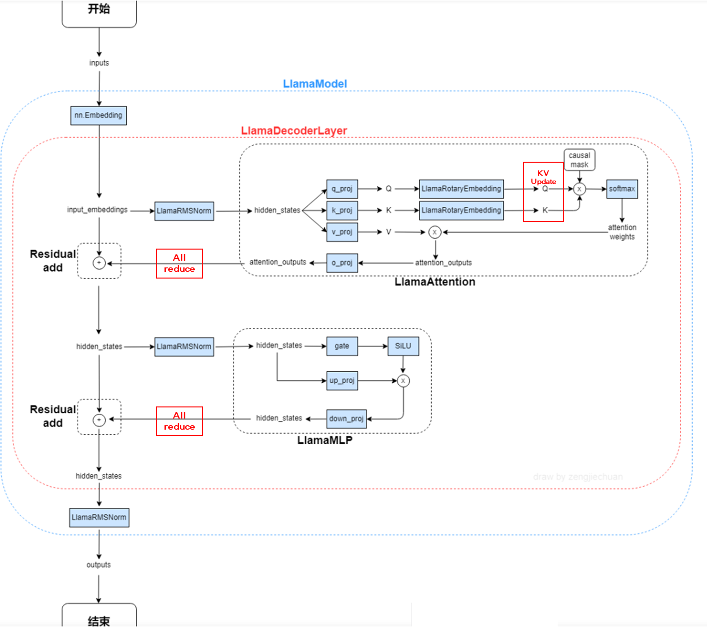

# PaddlePaddle 上部署优化 LLaMA 模型至 Gaudi HPU 的技术要点

 **目标**：实现高性能、全静态图、全算子部署于 HPU 上的大模型推理（以 LLaMA 为代表），显著减少 Fallback 现象，提升计算利用率。

---

## 一、算子支持完善：补齐 HPU 后端的关键基础算子

- **背景问题**：部分 Paddle 算子在 HPU 上无对应实现，触发 fallback 到 CPU，严重影响性能。
- **优化动作**：
  - 分析 Transformer 模型中所有 fallback 算子，逐一注册支持，如：
    - `index_copy`、`reshape`、`softmax`（特定 axis）、`scale`、`cast`、`matmul_v2` 等
  - 使用 `set_output` 和 `infer_shape` 等 API 完善 kernel 注册逻辑
- **工具辅助**：
  - 使用 `PADDLE_DEBUG=1` 或 `GLOG_v=3` 查看 fallback 情况

---

## 二、推理性能分析：性能 Profiling 定位瓶颈与空洞

- **目标**：识别推理执行中出现“空洞”（低算子利用率或 memory-bound 问题）的阶段。
- **方法**：
  - 使用 Habana Profiler 抓取运行 profiling log
  - 使用 chrome://tracing/ 打开log，分析每个 op 的执行时间与等待时间
  - 可视化算子时间线，观察 kernel 执行不连续或频繁数据传输的区域
- **结果输出**：
  - 发现瓶颈点，指导后续 fuse 和调度顺序优化

---

## 三、Tensor 静态化：避免动态 Shape 编译图路径

- **问题**：HPU 执行图不支持动态 shape 会触发 fallback 或触发 compile cache miss。
- **优化方式**：
  - 将输入及中间张量维度固定，如 batch size、seq_len、hidden size
  - 对动态 axis 使用 padding 保证形状统一
  - 使用 shape hint 或提前编译静态图结构
- **调试方法**：
  - 利用 shape trace 工具确认执行路径是否存在动态 shape

---

## 模型结构回顾：LLaMA 推理框架

为了更清晰理解后续的融合优化策略，我们回顾 LLaMA 解码器的结构：

> *图：LLaMA 解码器结构图，展示 RMSNorm、Self-Attention、MLP 的典型堆叠顺序。*

---

## 四、模块级融合：构建高性能 FusedOp（例如 Attention / MLP）

- **目的**：减少 kernel launch 次数与中间 memory I/O，提升整体吞吐。
- **典型融合策略**：
  - **MLP 模块**：融合 `linear1 + activation + linear2 + dropout + linear3`
  - **LayerNorm 融合**：将前置 `rmsnorm` 与 MLP 一起融合执行
  - **Attention 融合**：融合 `qkv projection + reshape + matmul + softmax + matmul + output projection`
- **实现方式**：
  - 编写 `FusedKernel` 并对外注册为自定义 OP
  - 利用静态 shape 支持重用 memory buffer，避免中间张量重复分配

---

## 五、构建静态图执行流：实现全图一体化优化

- **目标**：从动态图切换为完整静态图，提高编译与运行效率
- **实现方式**：
  - 使用 `paddle.jit.to_static` 或手动构建 `ProgramDesc`
  - 禁用 Eager 模式下的缓存与调试信息
  - 加入图级 Pass，如：
    - `inplace_fuse_pass`
    - `pre_op_fuse_pass`
- **优势**：
  - 更好利用 HPU 编译器图优化
  - 提高推理图缓存命中率

---

## 六、参数量化优化：从 BF16 动态量化至 Float8

- **目标**：减少内存带宽、加快计算速度，兼顾精度，适配 HPU 支持的低精度格式。
- **核心步骤**：
  1. 分析 BF16 参数范围（min/max），统计缩放比例
  2. 将权重进行 Float8 编码（如 E4M3/E5M2）
  3. 使用支持低精度的 FusedOp 替换传统 MatMul
  4. 采用静态 Shape 保证量化后张量维度不变
- **优势**：
  - 权重显存减少 50%
  - 推理内存带宽下降
  - HPU 上可启用更高级别的编译器图融合
- **注意事项**：
  - 精度评估需完整验证（通常 top-1 精度下降 < 1%）
  - 动态量化路径需要保持静态 shape，避免触发 fallback

---

## 总结：优化“六步走”策略总览

| 步骤 | 名称                   | 关键收益                                        |
|------|------------------------|-------------------------------------------------|
| 1    | 完善算子支持           | 避免 CPU fallback，提高设备利用率              |
| 2    | Profiling 分析         | 定位性能瓶颈与算子调度不合理的问题             |
| 3    | Tensor 静态化          | 防止动态 shape 触发 fallback 或编译失败        |
| 4    | Attention / MLP 融合   | 减少 launch 次数与中间数据传输                 |
| 5    | 构建静态图全流程       | 实现图级别优化、最大化编译器性能发挥           |
| 6    | 参数量化（如 Float8）  | 节省内存带宽、加速推理，兼顾精度与效率         |

---
