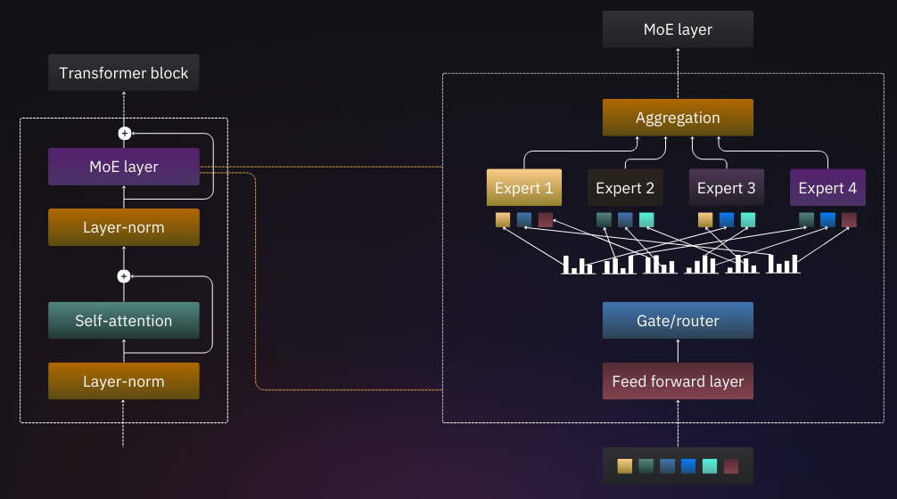

---

# 📑 目录

* [📌 混合专家（MoE）机制详解](#混合专家moe机制详解)

  * [🧮 1. 概述](#1-概述)
  * [🔗 2. 基本结构与流程](#2-基本结构与流程)
    * [🧊 2.1 模块组成](#21-模块组成)
    * [⏱️ 2.2 前向计算流程](#22-前向计算流程)
  * [📈 3. MoE 的优点与挑战](#3-moe-的优点与挑战)
    * [✅ 优势](#优势)
    * [⚠️ 挑战](#挑战)
  * [🛠️ 4. 重要变体与优化方法](#4-重要变体与优化方法)
    * [🎯 4.1 Gating 策略](#41-gating-策略)
    * [📊 4.2 平衡负载策略](#42-平衡负载策略)
    * [⚙️ 4.3 代表性架构](#43-代表性架构)
  * [🧪 5. 示例代码（Top-2 MoE）](#5-示例代码top-2-moe)
  * [6. 总结与前景](#6-总结与前景)
  * [7.🔧 HPU 工程优化实践](#7-hpu-工程优化实践)
    * [🚀 7.1 EP + TP 并行](#71-ep--tp-并行)
    * [🧩 7.2 计算图融合优化](#72-计算图融合优化)
    * [🫥 7.3 Dummy Experts 技术](#73-dummy-experts-技术)
    * [🔬 7.4 FP8 动态量化](#74-fp8-动态量化)

---

# **混合专家 (MoE) 机制详解**

## **1. 概述**

Mixture of Experts（MoE）是一种\*\*稀疏激活（sparse activation）\*\*的神经网络架构，核心思想是在每次前向传播中，**动态选择部分专家网络（experts）来处理输入 token**，以此大幅提升模型参数总量（容量）同时控制推理计算量。

MoE 由 Google（Shazeer et al., 2017）最早提出并应用于大规模语言建模，近年来广泛用于 Transformer 架构中，如 Switch Transformer、GShard、GLaM、Mixtral 等。


[](https://raw.githubusercontent.com/zongwave/pixelcraft/main/ai/llm/moe/diagram/Mixture-of-Experts-in-LLMs.png)


---

## **2. 基本结构与流程**

### **2.1 模块组成**

* **Experts（专家网络）**：

  * 一组并行的子网络（通常为 Feed-Forward Networks, FFNs）。
  * 所有专家结构相同但参数独立。

* **Gating Network（门控网络）**：

  * 一个轻量级网络，通常是一个线性变换 `W_g`，输出 token 对各专家的匹配分数。
  * 用于选择 Top-K 个激活的专家。

* **Dispatch & Combine（分发与组合）**：

  * 将输入分发给所选专家；
  * 汇总专家输出时根据得分权重进行加权。

---

### **2.2 前向计算流程**

设输入张量为 `x`，维度为 `[batch_size, seq_len, hidden_dim]`，MoE 层流程如下：

1. **门控打分**：

   ```python
   scores = x @ W_g.T  # [batch, seq_len, num_experts]
   ```

   对每个 token 计算每个专家的得分。

2. **Top-K 选择**（通常是 Top-1 或 Top-2）：

   ```python
   topk_scores, topk_indices = topk(scores, k=K, dim=-1)
   ```

3. **分发与专家前向计算**：
   将每个 token 仅发送至其 Top-K 专家。

4. **输出组合**：
   将 Top-K 专家的输出按照 softmax(score) 加权求和，作为最终输出。


```mermaid
sequenceDiagram
    %% 图注说明：
    %% MoELayer 表示混合专家模块的整体调用入口；
    %% GateScoring 负责计算每个 token 的专家选择得分；
    %% GateDispatch 根据 gate_scores 选择 Top-k 专家，并生成 dispatch mask 与组合权重；
    %% ExpertParallel 模块表示并行执行的多个专家网络；
    %% Combine 阶段使用权重对多个专家输出进行聚合；

    participant MoELayer as MoELayer<br/>（混合专家层）
    participant GateScoring as GateScoring<br/>（得分计算）
    participant GateDispatch as GateDispatch<br/>（分发掩码与权重）
    participant ExpertParallel as ExpertParallel<br/>（并行专家）
    participant Combine as Combine<br/>（输出聚合）

    MoELayer ->> GateScoring: compute gate_scores(input)
    GateScoring -->> MoELayer: gate_scores

    MoELayer ->> GateDispatch: dispatch(gate_scores)
    GateDispatch -->> MoELayer: dispatch_mask, combine_weights

    MoELayer ->> ExpertParallel: run selected experts(input × dispatch_mask)
    ExpertParallel -->> MoELayer: expert_outputs

    MoELayer ->> Combine: combine(expert_outputs, combine_weights)
    Combine -->> MoELayer: output

```
---

## **3. MoE 的优点与挑战**

### **优势**

| 优点        | 说明                                      |
| --------- | --------------------------------------- |
| **计算效率高** | 每个 token 只激活少量专家，减少总体 FLOPs。            |
| **模型容量大** | 可以部署上千个专家，提升泛化能力与表示能力。                  |
| **易于并行化** | 专家模块可跨 GPU/TPU 分布，天然支持 expert parallel。 |

---

### **挑战**

| 挑战                       | 说明                             |
| ------------------------ | ------------------------------ |
| **负载不均（load imbalance）** | 不同专家接收 token 数目不均，导致计算瓶颈。      |
| **专家稀疏性优化难**             | 反向传播过程中非激活专家不更新，难以训练。          |
| **通信开销大**                | 分布式 MoE 中 token 与专家之间需频繁跨节点通信。 |

---

## **4. 重要变体与优化方法**

### **4.1 Gating 策略**

| 策略            | 特点                                      |
| ------------- | --------------------------------------- |
| Top-1 Gating  | 每个 token 只路由到一个专家，最高稀疏度，效率最优。           |
| Top-2 Gating  | 路由到两个专家，提升表示能力并缓解负载不均。                  |
| Noisy Top-K   | 添加随机噪声以避免“死专家”问题（如 GShard）。             |
| Switch Gating | 特化为 Top-1 + 路由拒绝机制（Switch Transformer）。 |

---

### **4.2 平衡负载策略**

* **Auxiliary Loss**：对 gating 得分加入负载均衡正则项（如 Switch Transformer）。
* **Token Dropping**：超载专家拒绝 token（以保持负载均衡）。
* **Routing Softmax**：将 softmax 限制在 Top-K 范围内，避免激活稀疏分布。

---

### **4.3 代表性架构**

| 模型                 | 特点                                |
| ------------------ | --------------------------------- |
| GShard (Google)    | 支持数千个专家的训练，首次展示 MoE 扩展性。          |
| Switch Transformer | Top-1 gating，轻量门控，高效实用。           |
| GLaM (Google)      | 每个 token 激活两个专家，带权组合，精度优。         |
| Mixtral (Mistral)  | 使用 Top-2 Gating + FFN MoE，高精度大模型。 |

---

## **5. 示例代码（Top-2 MoE）**

```python
class MoELayer(nn.Module):
    def __init__(self, hidden_dim, ffn_dim, num_experts, top_k=2):
        super().__init__()
        self.experts = nn.ModuleList([
            nn.Sequential(
                nn.Linear(hidden_dim, ffn_dim),
                nn.ReLU(),
                nn.Linear(ffn_dim, hidden_dim)
            ) for _ in range(num_experts)
        ])
        self.gate = nn.Linear(hidden_dim, num_experts)
        self.top_k = top_k

    def forward(self, x):  # [batch, seq_len, hidden_dim]
        gate_scores = self.gate(x)  # [batch, seq_len, num_experts]
        topk_vals, topk_indices = torch.topk(gate_scores, self.top_k, dim=-1)

        # Softmax over top-k for weighting
        topk_weights = F.softmax(topk_vals, dim=-1)

        output = torch.zeros_like(x)
        for k in range(self.top_k):
            expert_idx = topk_indices[..., k]
            weight = topk_weights[..., k].unsqueeze(-1)
            for i, expert in enumerate(self.experts):
                mask = (expert_idx == i)
                if mask.any():
                    expert_input = x[mask]
                    out = expert(expert_input)
                    output[mask] += weight[mask] * out

        return output
```

---

## **6. 总结与前景**

MoE 已成为**大模型稀疏化**和**大参数量建模**的核心技术之一，其显著特点是\*\*“激活稀疏 + 参数密集”\*\*。未来的方向包括：

* 更高效的 token-expert 匹配机制；
* 更精细的负载均衡调度；
* 与分布式推理和专家缓存机制的深度融合；
* 结合多模态场景（如视觉+语言）的专家调度。


---

## **7. HPU 工程优化实践**

### 7.1 **EP + TP 并行**

* **Expert Parallelism (EP)**：将不同的 experts 分布在多个 HPU 上并行处理，可提升设备利用率，尤其在专家数量较多时。
* **Tensor Parallelism (TP)**：将单个 FFN expert 中的矩阵运算分布到多个 HPU 核中进行拆分并并行。
* **优化要点**：

  * 利用 HPU 的高带宽 interconnect（例如 RoCE / PCIe）进行高效通信。
  * 在路由结果静态化后，提前调度通信与计算，实现 overlap。

---

### 7.2 **计算图融合优化**

* **问题背景**：

  * 若 gating、dispatch、FFN 分别执行，会引入频繁的数据移动与 kernel 调度，尤其在小 batch 时表现更差。
* **优化方法**：

  * 将 `Gating -> Token dispatch -> Expert FFN -> Combine` 合并为一个统一 kernel，利用 HPU 的算子融合能力（如 Habana Fusion Compiler）。
  * 减少 memory I/O 开销、launch overhead 与中间同步。
* **效果**：延迟大幅下降，吞吐提升明显。

---

### 7.3 **Dummy Experts 技术**

* **背景问题**：

  * HPU 对动态图（Dynamic graph）的第一次编译开销极大，MoE 中 token 激活的专家组合可能变化频繁。
* **优化策略**：

  * 编译期：将所有可能激活的 expert 实例化并统一编译入图（Static Graph）。
  * 运行期：只根据 routing 分配 token，未选中的专家不参与实际计算（dummy experts，输入为0，或提前裁剪）。
* **优势**：

  * 避免 runtime 图编译，提高首次推理速度。
  * 保持高并发性与统一调度模式，提升编译器优化能力。

---

### 7.4 **FP8 动态量化**

* **动机**：

  * 在保持模型精度的同时进一步降低计算/内存带宽。
* **实现方式**：

  * 对 experts 中的权重与中间激活采用 **FP8（8-bit floating point）** 表示。
  * 结合 **dynamic quantization** 和 **calibration-aware training** 保证数值稳定性。
* **优化点**：

  * HPU 上提供对 FP8 加速指令的支持，可直接调度低精度计算核。
  * 采用 per-channel scale + per-layer clipping 控制量化误差。
* **效果**：

  * 显著减少带宽压力和显存消耗。
  * 吞吐提升同时精度下降可控。

---

### 7.5 总结

| ⚙️ 优化点           | ✅ 优势           | ⚠️ 挑战              |
| ---------------- | -------------- | ------------------ |
| 🧩 EP + TP       | 高效并行利用多设备      | 通信调度复杂，需优化 overlap |
| 🔗 Kernel Fusion | 降低调用延迟，提升效率    | 需要高度定制 kernel，开发复杂 |
| 👻 Dummy Experts | 消除动态图开销，提升吞吐   | 编译期图构建复杂，需完整覆盖专家组合 |
| 🧊 FP8 量化        | 极致压缩计算与内存，提升性能 | 精度敏感，需精细调优         |

---
