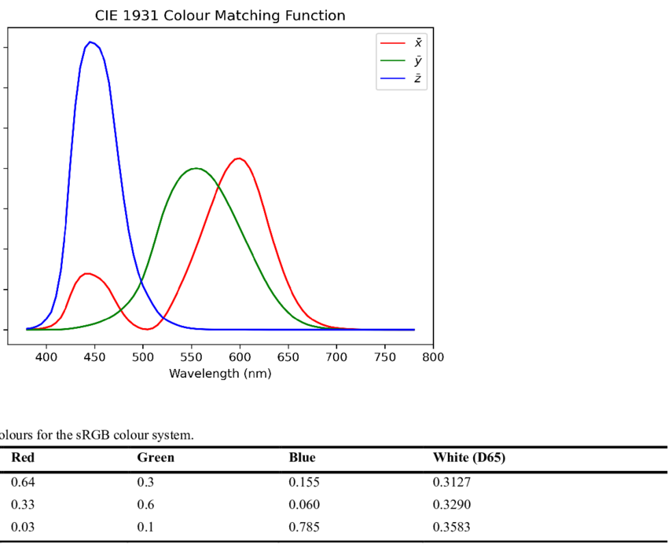
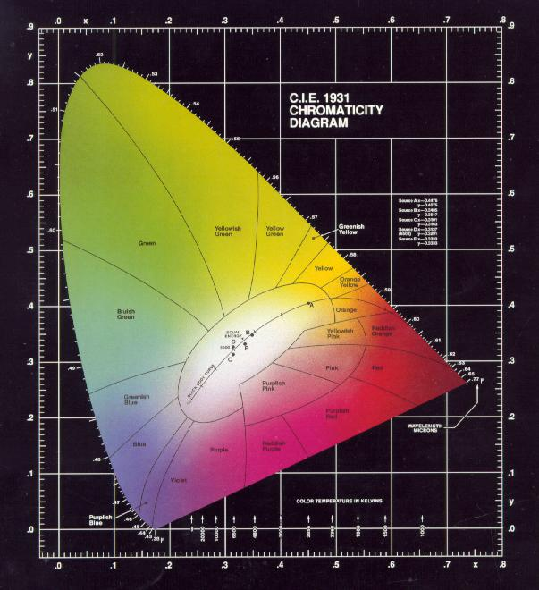
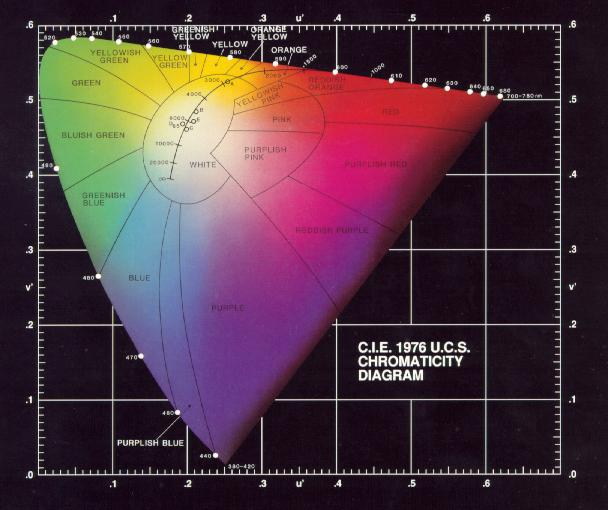

# Auto White Balance (AWB) 技术总结

## 目录
- [Auto White Balance (AWB) 技术总结](#auto-white-balance-awb-技术总结)
  - [目录](#目录)
  - [1. 灰世界算法 (Grey World)](#1-灰世界算法-grey-world)
    - [核心假设](#核心假设)
    - [算法流程](#算法流程)
    - [生理学基础](#生理学基础)
      - [绿色通道特性](#绿色通道特性)
  - [2. 白点算法 (White Point)](#2-白点算法-white-point)
    - [核心假设](#核心假设-1)
    - [算法流程](#算法流程-1)
  - [3. EP3149936B1 专利算法](#3-ep3149936b1-专利算法)
    - [核心思想](#核心思想)
    - [关键步骤](#关键步骤)
    - [物理意义](#物理意义)
    - [一句话总结](#一句话总结)
    - [主导色检测机制](#主导色检测机制)
    - [动态算法切换](#动态算法切换)
  - [4. 算法对比](#4-算法对比)
    - [技术对比框架](#技术对比框架)
    - [色温范围表](#色温范围表)
  - [5. 色彩空间标准](#5-色彩空间标准)
  - [6. 色度坐标系统详解](#6-色度坐标系统详解)
    - [CIE 1931 xy 色度坐标](#cie-1931-xy-色度坐标)
      - [核心特点](#核心特点)
      - [主要问题](#主要问题)
    - [CIE 1976 u'v' 色度坐标](#cie-1976-uv-色度坐标)
    - [系统对比表](#系统对比表)
  - [7. 色差公式](#7-色差公式)
    - [色差补充（ΔE₀₀）](#色差补充δe)
  - [8. AWB 调优 Checklist](#8-awb-调优-checklist)

---

## 1. 灰世界算法 (Grey World)

### 核心假设
自然场景中颜色的光谱反射率在统计上是中性的（即整体平均反射率呈现灰色）：
```math
E[R] = E[G] = E[B]
```
（其中E[·]表示期望/均值）

### 算法流程
1）计算图像中R/G/B通道的均值

```math
R_{avg} = \frac{1}{N}\sum_{i=1}^{N}R_i, \quad 
G_{avg} = \frac{1}{N}\sum_{i=1}^{N}G_i, \quad 
B_{avg} = \frac{1}{N}\sum_{i=1}^{N}B_i
```

2）增益计算（以G通道为基准）

```math
Gain_R = \frac{G_{avg}}{R_{avg}}, \quad 
Gain_B = \frac{G_{avg}}{B_{avg}}, \quad 
Gain_G = 1
```

### 生理学基础
人眼对绿光（555nm）最敏感（亮度公式权重：G=58.7%, R=29.9%, B=11.4%）
```math
L = 0.299 \times R + 0.587 \times G + 0.114 \times B
```
> 注：Rec.601 亮度权重

#### 绿色通道特性
自然场景中绿色物体（植被等）占比最高，统计上G通道方差最小。
> 仅统计意义上成立，若画面为大面积蓝天则 B 方差最小。
以G为基准能更好地保持亮度一致性。
Bayer传感器中绿色像素占比50%（如RGGB排列）。


## 2. 白点算法 (White Point)

### 核心假设
图像高光区域（最亮像素）的色度应接近理想白色（如D65光源的色度坐标x=0.3127, y=0.3290）。

### 算法流程
1）高光区域选择
亮度计算（Rec.709标准）

```math
Luminance(p) = 0.299 \times R_p + 0.587 \times G_p + 0.114 \times B_p
```
候选像素

```text
CandidatePixels = { p | Luminance(p) > T_{high} }
```

阈值设定

```math
T_{high} = 0.9 \times \max(Luminance(p))
```

2）白点候选判定
RGB→XYZ转换

```math
\begin{bmatrix} X \\ Y \\ Z \end{bmatrix} = 
\begin{bmatrix} 
0.4124 & 0.3576 & 0.1805 \\ 
0.2126 & 0.7152 & 0.0722 \\ 
0.0193 & 0.1192 & 0.9505 
\end{bmatrix}
\begin{bmatrix} R_{linear} \\ G_{linear} \\ B_{linear} \end{bmatrix}
```

色度坐标计算（CIE 1976 UCS）

```math
u' = \frac{4X}{X + 15Y + 3Z}, \quad 
v' = \frac{9Y}{X + 15Y + 3Z}
```

白点候选集

```math
WhiteCandidates = { p | \Delta u'v'(p) < T_{u'v'} }, \quad
T_{u'v'} = 0.02
```

3）色温匹配
测量值：

```math
(R/G)_{measured} = \text{median}(R_p/G_p), \quad 
(B/G)_{measured} = \text{median}(B_p/G_p)

```

查询传感器AWB标定曲线

```math
CCT_{estimated} = AWB^{-1}_{LUT}((R/G)_{measured}, (B/G)_{measured})
```
```math
\text{Target}_{R/G} = \text{AWB}_{\text{Curve}_{RG}}( \text{CCT} ) \\
\text{Target}_{B/G} = \text{AWB}_{\text{Curve}_{BG}}( \text{CCT} )
```

4）增益计算
```math
Gain_R = \frac{Target_{R/G}}{(R/G)_{measured}}, \quad 
Gain_B = \frac{Target_{B/G}}{(B/G)_{measured}}, \quad 
Gain_G = 1
```

## 3. EP3149936B1 专利算法

### 核心思想
动态切换算法：
白点法 → 失败 → 灰世界法 → 单色场景 → 网格分析+中性点校正法

```mermaid
graph TD
    A[输入图像] --> B{白点检测?}
    B -- 是 --> C[白点算法]
    B -- 否 --> D{单色场景检测?}
    D -- 是 --> E[网格分析法+中性点校正]
    D -- 否 --> F[灰世界算法]
```


### 关键步骤

1）传感器标定

实验室标准光源（D65/D50）照射灰卡，测量传感器输出（R/G）与（B/G）的比值：

```math
K_{CCT} = \frac{(R/G)_{CCT}}{(B/G)_{CCT}}
```

2）关键参考点
选择曲线上 R/G = B/G 的点作为中性参考点（即传感器对该光照的色度无偏响应点）。


3）单色区域判定

网格化分析
图像分割为网格，分块计算均值与方差

```math
\sigma(R/G) < 0.05, \quad \sigma(B/G) < 0.05
```
判定条件：超过30%网格满足低方差


4）增益计算

```math
Gain_R = \frac{K_{CCT}}{Current_{R/G}}, \quad 
Gain_B = \frac{K_{CCT}}{Current_{B/G}}, \quad 
Gain_G = 1.0
```

5）异常处理

增益边界保护

```math
Gain_R \in [0.5, 2.0], \quad Gain_B \in [0.5, 2.0]
```


### 物理意义
将当前图像的色彩比例对齐到传感器标定的中性状态，消除硬件偏差（如B通道灵敏度不足）。


### 一句话总结
该专利通过标定传感器多色温下的R/G-B/G中性点曲线，动态对齐图像色彩比例至传感器理想响应状态，同时结合场景检测实现自适应白平衡。


### 主导色检测机制
网格化分析：
将图像分块，统计每块在R/G-B/G平面的分布。

动态阈值：
当单色网格占比超阈值（如30%），判定为单色主导场景。


### 动态算法切换
| 场景类型         | 启用算法           | 禁用算法   | 技术实现                     |
|------------------|--------------------|------------|------------------------------|
| 色彩丰富场景     | 灰世界法           | -          | 全局均值统计                 |
| 单色主导场景     | 传感器中性点法     | 灰世界法   | 使用R/G=B/G参考点计算增益    |
| 含白点场景       | 白点法             | -          | 高光区域色度匹配             |


## 4. 算法对比
### 技术对比框架

| 维度               | 灰世界算法 (G基准)              | 白点算法 (白基准)            | EP3149936B1方案               |
|--------------------|--------------------------------|-----------------------------|-------------------------------|
| **参考基础**       | 全局统计均值假设               | 局部最亮点色度              | 传感器物理响应特性            |
| **优势场景**       | 自然光照下的植被/户外，色彩丰富画面 | 含真实白点的室内场景        | 单色/无灰白参考场景           |
| **单色场景处理**   | 失效（强制拉灰）               | 依赖白点存在性              | 动态切换至传感器中性点法      |
| **色温适应性**     | 无显式建模                     | 需预存色温曲线              | 通过响应曲线自动适应          |
| **数学表达**       | 均值均衡                       | 色温映射                    | 响应曲线中性点定位（图3）     |
| **硬件依赖**       | 无                             | 需标定                      | 需预存传感器响应数据          |
| **计算复杂度**     | 低（全局统计）                 | 中（高光检测）              | 中（网格分析+曲线查询）       |

### 色温范围表
| 光源 | CCT (K) | 典型场景 |
|------|---------|----------|
| 烛光 | 1800–2000 | 夜景 |
| 白炽灯 | 2700–3000 | 室内 |
| D50 | 5000 | 印刷 |
| D65 | 6500 | 日光 |

## 5. 色彩空间标准


[](https://raw.githubusercontent.com/zongwave/pixelcraft/main/isp/3a/diagram/CIE-1931-colour-matching-function.png)


[](https://raw.githubusercontent.com/zongwave/pixelcraft/main/isp/3a/diagram/cie1931.jpg)
[](https://raw.githubusercontent.com/zongwave/pixelcraft/main/isp/3a/diagram/cie1976.jpg)


## 6. 色度坐标系统详解

### CIE 1931 xy 色度坐标
```math
\begin{aligned}
x &= \frac{X}{X + Y + Z} \\
y &= \frac{Y}{X + Y + Z} \\
z &= 1 - x - y \quad \text{(推导值)}
\end{aligned}
```

#### 核心特点

最早的国际标准色彩空间

将XYZ三刺激值归一化为二维坐标

亮度信息(Y)被分离，仅保留色度

色度图呈现马蹄形分布

#### 主要问题

绿色区域过度膨胀（占色度图50%）

蓝色区域被严重压缩

相同Δxy在不同区域代表的色差感知不一致


### CIE 1976 u'v' 色度坐标
```math
\begin{aligned}
u' &= \frac{4X}{X + 15Y + 3Z} \\
v' &= \frac{9Y}{X + 15Y + 3Z}
\end{aligned}
```

### 系统对比表

| 特性             | CIE 1931 xy                  | CIE 1976 u'v'                |
|------------------|------------------------------|------------------------------|
| **开发目的**     | 基础色彩标准化               | 感知均匀性优化               |
| **标准白点(D65)**| x=0.3127, y=0.3290           | u'=0.1978, v'=0.4683         |
| **色差灵敏度**   | 1 JND ≈ 0.01 Δxy             | 1 JND ≈ 0.005 Δu'v'          |
| **工业应用**     | 色域定义                     | 产线色彩检测                 |

> **注**：JND (Just Noticeable Difference) 表示最小可觉色差

## 7. 色差公式
```math
\Delta E_{uv} = \sqrt{(u'_1 - u'_2)^2 + (v'_1 - v'_2)^2}
```
### 色差补充（ΔE₀₀）
$$
\Delta E_{00} = \sqrt{
\left(\frac{\Delta L'}{k_L}\right)^2 +
\left(\frac{\Delta C'}{k_C}\right)^2 +
\left(\frac{\Delta H'}{k_H}\right)^2 +
R_T \frac{\Delta C'}{k_C} \frac{\Delta H'}{k_H}
}
$$

## 8. AWB 调优 Checklist

| 检查项 | 通过标准 |
|---|---|
| 标定曲线覆盖 | 2500 K – 10000 K 误差 < 3 % |
| 单色场景误判 | 纯色卡 100 张，误触发 < 5 % |
| 肤色保护 | ITU-R 肤色卡 ΔE₀₀ < 2 |

