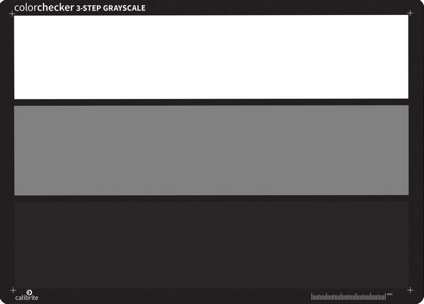
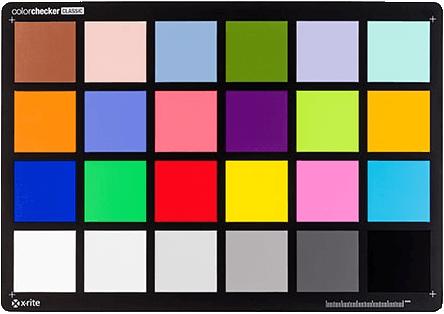
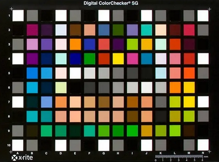
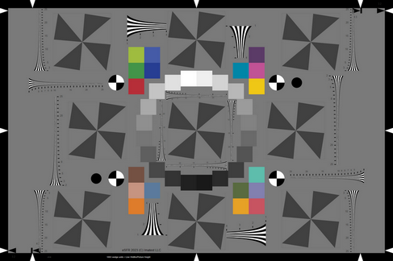

# libxcam 图像质量（IQ）调优系统技术总结

主要用于处理时间噪声抑制（TNR）、拜耳噪声抑制（BNR）和边缘增强（EE）等功能。以下是它们如何协同工作以及完成的功能的总结。

## 目录
- [libxcam IQ Tunning 技术总结](#libxcam-iq-tunning-技术总结)
  - [目录](#目录)
  - [1. 现代ISP调优的通用原理与方法](#1-现代isp调优的通用原理与方法)
    - [1.1 自动曝光（AE）](#11-自动曝光ae)
    - [1.2 自动白平衡（AWB）](#12-自动白平衡awb)
    - [1.3 自动对焦（AF）](#13-自动对焦af)
    - [1.4 噪声抑制（NR）](#14-噪声抑制nr)
    - [1.5 边缘增强（EE）](#15-边缘增强ee)
    - [1.6 调优框架](#16-调优框架)
    - [1.7 3A调校使用的标准图板](#17-3a调校使用的标准图板)
  - [2. libxcam 图像质量调优系统](#2-libxcam-图像质量调优系统)
    - [2.1 核心组件](#21-核心组件)
    - [2.2 协同工作](#22-协同工作)
    - [2.3 完成的功能](#23-完成的功能)
    - [2.4 系统流程框图](#24-系统流程框图)
    - [2.5 总结](#25-总结)

## 1. 现代ISP调优的通用原理与方法
图像信号处理器（ISP）在现代相机系统中扮演着至关重要的角色，负责将原始图像数据转换为高质量的图像输出。ISP调优的目的是通过一系列算法和参数调整，优化图像的视觉效果，确保在不同的拍摄条件下都能获得最佳的图像质量。以下是现代ISP调优的通用原理与方法：

### 1.1 自动曝光（AE）
自动曝光（AE）模块的目标是根据场景的亮度自动调整曝光参数，以确保图像的亮度适中。主要步骤包括：
- **测光**：分析图像的亮度分布，计算场景的平均亮度。
- **曝光控制**：调整曝光时间、光圈大小和ISO值，以达到理想的亮度。
- **动态范围优化**：在高对比度场景中，通过调整曝光参数，优化图像的动态范围，减少过曝和欠曝区域。

### 1.2 自动白平衡（AWB）
自动白平衡（AWB）模块的目标是根据场景的色温自动调整图像的色彩平衡，以确保图像的色彩自然。主要步骤包括：
- **色温检测**：分析图像的色彩分布，计算场景的色温。
- **色彩校正**：根据检测到的色温，调整RGB通道增益，以消除色偏。
- **自适应调整**：根据不同场景的光照条件，动态调整白平衡参数，以适应不同的色温变化。

### 1.3 自动对焦（AF）
自动对焦（AF）模块的目标是自动调整镜头的焦距，使拍摄对象清晰。主要步骤包括：
- **对焦区域选择**：根据场景内容选择合适的对焦区域。
- **对焦算法**：使用对比度检测或相位检测等算法，计算最佳对焦位置。
- **对焦控制**：调整镜头的焦距，使拍摄对象清晰。
- **对焦优化**：根据不同场景和拍摄对象，动态调整对焦参数，以优化对焦速度和准确性。

### 1.4 噪声抑制（NR）
噪声抑制（NR）模块的目标是减少图像中的噪声，同时保留图像的细节。主要步骤包括：
- **噪声检测**：通过分析图像的统计特性，检测噪声的分布和强度。
- **噪声抑制算法**：应用多种噪声抑制算法，如时间噪声抑制（TNR）、拜耳噪声抑制（BNR）和小波去噪（Wavelet Denoise），以减少噪声。
- **参数调整**：根据当前的图像参数（如模拟增益、曝光时间等），动态调整噪声抑制参数，以优化去噪效果。

### 1.5 边缘增强（EE）
边缘增强（EE）模块的目标是增强图像的边缘细节，使图像更加清晰。主要步骤包括：
- **边缘检测**：通过图像处理算法（如Sobel算子、Canny算子等），检测图像中的边缘。
- **边缘增强**：根据检测到的边缘，调整图像的对比度和锐度，以增强边缘细节。
- **参数调整**：根据当前的图像参数（如模拟增益、曝光时间等），动态调整边缘增强参数，以优化图像的清晰度。

### 1.6 调优框架
ISP调优框架通常包括以下步骤：
- **初始化**：加载预设的调优参数和配置文件，初始化调优模块。
- **参数配置**：根据当前的图像参数，动态调整调优模块的参数。
- **调优计算**：在图像处理过程中，调优模块根据当前的图像参数，动态调整调优参数。
- **结果输出**：将调优模块计算出的参数应用到图像处理中，生成最终的优化图像。

```mermaid
flowchart TD
    subgraph 输入源
    A[Raw Image] --> B[3A统计信息]
    end

    subgraph 3A控制循环
    C{3A算法}
    B --> C
    C --> D["AE控制<br/>自动曝光"]
    C --> E["AWB控制<br/>自动白平衡"]
    C --> F["AF控制<br/>自动对焦"]
    D --> G[曝光参数]
    E --> H[白平衡增益]
    F --> I[对焦位置]
    end

    subgraph ISP处理管线
    G & H & I --> J[传感器校正]
    J --> K[黑电平校正]
    K --> L[镜头阴影校正]
    L --> M[去马赛克]
    M --> N[色彩校正矩阵]
    N --> O[Gamma校正]
    end

    subgraph 降噪增强
    O --> P[时域降噪TNR]
    O --> Q[空域降噪BNR]
    P & Q --> R[锐化与边缘增强]
    end

    subgraph 输出
    R --> S[YUV/RGB输出]
    end

    subgraph 反馈环
    S --> T[图像质量评估]
    T -->|动态调优| C
    T -->|参数优化| U[调优数据库]
    U --> C
    end

```

### 1.7 3A调校使用的标准图板
在3A（自动曝光、自动白平衡、自动对焦）调校过程中，通常会使用以下几种标准图板：
- **灰度图板**：
  - **用途**：用于自动曝光（AE）和自动白平衡（AWB）的调校。灰度图板通常包含不同灰度级别的区域，帮助相机校准曝光和白平衡。
  - **示例**：灰色图表必须覆盖相机视野范围的中心30%，用于适度质询3A（自动曝光、自动白平衡和自动对焦），因为中心区域没有任何特征。

- **ColorChecker图板**：
  - **用途**：用于自动白平衡（AWB）的调校。ColorChecker图板包含多种标准颜色块，帮助相机校准色彩平衡。
  - **示例**：本发明所采用的标准色板（ColorChecker）的色块，用于找出各色块对色温偏离的预测曲线，从而调整影像至最接近人眼所看到的色彩。

- **对焦图板**：
  - **用途**：用于自动对焦（AF）的调校。对焦图板通常包含高对比度的线条或图案，帮助相机校准对焦系统。
  - **示例**：对焦图板可以包含不同距离的线条或图案，用于测试和校准相机的对焦性能。
- **混合图板**：
  - **用途**：用于综合调校3A功能。混合图板通常包含灰度区域、颜色块和对焦图案，用于同时测试和校准AE、AWB和AF。
  - **示例**：某些测试图板结合了灰度区域和颜色块，用于同时测试自动曝光和自动白平衡。

> 这些标准图板在3A调校过程中非常重要，因为它们提供了标准化的测试环境，帮助确保相机在不同光照条件和场景下都能准确地调整曝光、白平衡和对焦。

## 2. libxcam 图像质量调优系统

### 2.1 核心组件
- **`X3aCiqTuningHandler`**：
  - **功能**：作为基类，提供通用框架，管理调优数据和处理器（如AE和AWB处理器）。
  - **作用**：为具体调优任务提供基础支持。
  - **关键方法**：
    - `set_tuning_data`：设置调优数据。
    - `set_ae_handler`和`set_awb_handler`：设置AE和AWB处理器。
    - `get_max_analog_gain`、`get_current_analog_gain`、`get_current_exposure_time`、`get_current_estimate_cct`：获取模拟增益、曝光时间、色温等信息。

- **`X3aCiqTnrTuningHandler`**：
  - **功能**：派生类，处理时间噪声抑制（TNR）调优。
  - **作用**：根据模拟增益，插值计算TNR配置参数，添加至结果列表。
  - **关键方法**：
    - `analyze`：计算TNR配置参数。

- **`X3aCiqBnrEeTuningHandler`**：
  - **功能**：派生类，处理拜耳噪声抑制（BNR）和边缘增强（EE）调优。
  - **作用**：根据模拟增益，插值计算BNR和EE配置参数，添加至结果列表。
  - **关键方法**：
    - `analyze`：计算BNR和EE配置参数。

### 2.2 协同工作
- **初始化**：
  - `X3aAnalyzeTuner`初始化时，调用`create_tuning_handlers`，创建具体调优处理器。
  - 调优处理器设置AE和AWB处理器，获取图像参数（模拟增益、曝光时间等）。

- **参数配置**：
  - `X3aAnalyzeTuner`通过`analyze_ae`、`analyze_awb`、`analyze_af`和`analyze_common`更新AE、AWB、AF和通用参数。
  - 参数传递给调优处理器，用于后续计算。

- **调优计算**：
  - 3A分析前后，`X3aAnalyzeTuner`调用`pre_3a_analyze`和`post_3a_analyze`处理统计数据。
  - `post_3a_analyze`中，调用调优处理器的`analyze`方法，计算配置参数。
  - 如`X3aCiqTnrTuningHandler`通过`linear_interpolate_p2`计算TNR参数，`X3aCiqWaveletTuningHandler`计算小波去噪参数，`X3aCiqBnrEeTuningHandler`计算BNR和EE参数。

- **结果输出**：
  - 调优处理器的配置参数封装至结果列表，供后续图像处理模块使用。

### 2.3 完成的功能
- **时间噪声抑制（TNR）**：
  - 通过`X3aCiqTnrTuningHandler`，根据模拟增益，计算YUV和3D噪声抑制参数，优化时间噪声抑制效果。
  - 参数包括增益、阈值，通过插值得出。

- **`X3aCiqWaveletTuningHandler`**：
  - **功能**：派生类，处理小波去噪（Wavelet Denoise）调优。
  - **作用**：根据模拟增益，插值计算小波去噪配置参数，添加至结果列表。
  - **关键方法**：
    - `analyze`：计算小波去噪配置参数。

- **拜耳噪声抑制（BNR）**：
  - 通过`X3aCiqBnrEeTuningHandler`，根据模拟增益，选择合适噪声抑制表（如`table_2_0`或`table_0_0_5`），优化拜耳噪声抑制效果。

- **边缘增强（EE）**：
  - 通过`X3aCiqBnrEeTuningHandler`，根据模拟增益，计算边缘增强参数，优化边缘增强效果。
  - 参数包括增益和阈值，通过插值得出。

### 2.4 系统流程框图
```mermaid
flowchart TD
    %% Main Components
    X3aAnalyzeTuner[X3aAnalyzeTuner\nMain Controller] -->|sets| X3aAnalyzer[X3aAnalyzer\nBase 3A Analyzer]
    X3aAnalyzeTuner -->|creates| TuningHandlers[Create Tuning Handlers]
    
    %% Tuning Handlers
    TuningHandlers --> TnrHandler[X3aCiqTnrTuningHandler\nTemporal Noise Reduction]
    TuningHandlers --> BnrEeHandler[X3aCiqBnrEeTuningHandler\nBayer NR & Edge Enhance]
    TuningHandlers --> WaveletHandler[X3aCiqWaveletTuningHandler\nWavelet Denoise]
    
    %% AE/AWB Dependency
    TnrHandler -->|uses| AeAwb[AE/AWB Handlers]
    BnrEeHandler -->|uses| AeAwb
    WaveletHandler -->|uses| AeAwb
    
    %% Data Flow
    X3aAnalyzeTuner -->|analyze_ae/awb/af/common| UpdateParams[Update Parameters]
    X3aAnalyzeTuner -->|pre_3a_analyze| SaveStats[Save Statistics]
    X3aAnalyzeTuner -->|post_3a_analyze| PushStats[Push Stats to Analyzer]
    PushStats --> HandlerAnalysis[Handler Analysis]
    HandlerAnalysis --> TnrHandler
    HandlerAnalysis --> BnrEeHandler
    HandlerAnalysis --> WaveletHandler
    
    %% Static Data
    TnrHandler -->|uses| TnrData[imx185_tuning\nTNR Static Data]
    BnrEeHandler -->|uses| BnrEeData[imx185_tuning\nBNR/EE Static Data]
    WaveletHandler -->|uses| WaveletData[imx185_tuning\nWavelet Static Data]
    
    %% Styling
    style X3aAnalyzeTuner fill:#f9f,stroke:#333
    style X3aAnalyzer fill:#bbf,stroke:#333
    style TuningHandlers fill:#f96,stroke:#333
    style TnrHandler fill:#9f9,stroke:#333
    style BnrEeHandler fill:#9f9,stroke:#333
    style WaveletHandler fill:#9f9,stroke:#333
    style AeAwb fill:#aaf,stroke:#333
```

### 2.5 总结
这些代码片段实现了一个完整的图像质量调优系统，能够根据图像参数动态调整时间噪声抑制（TNR）、拜耳噪声抑制（BNR）和边缘增强（EE）等设置，优化图像质量。系统采用面向对象设计和模块化实现，具有良好的扩展性和可维护性。